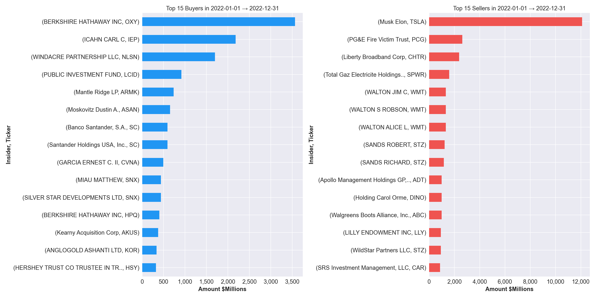
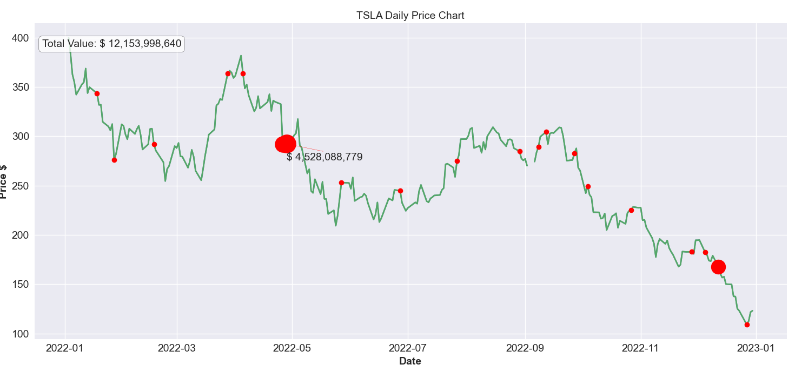
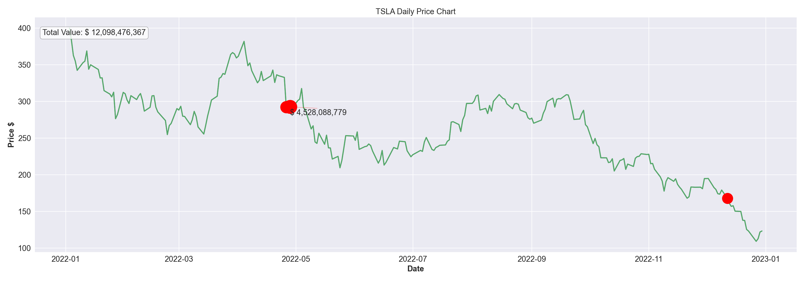
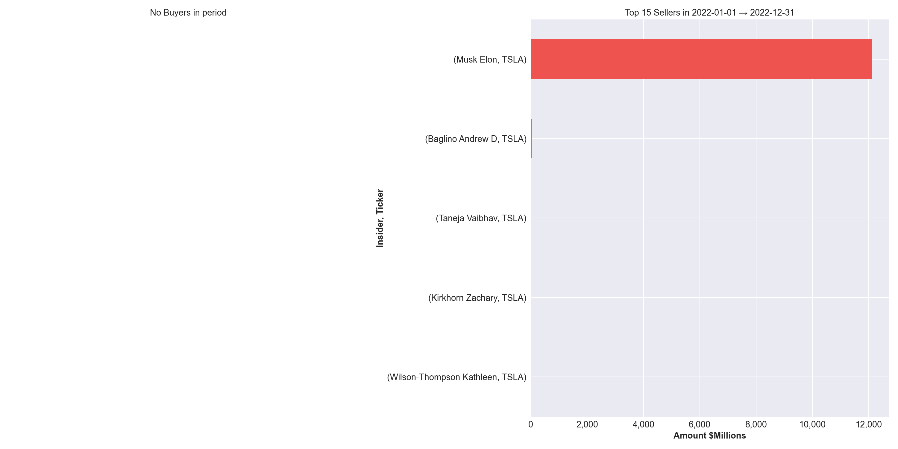
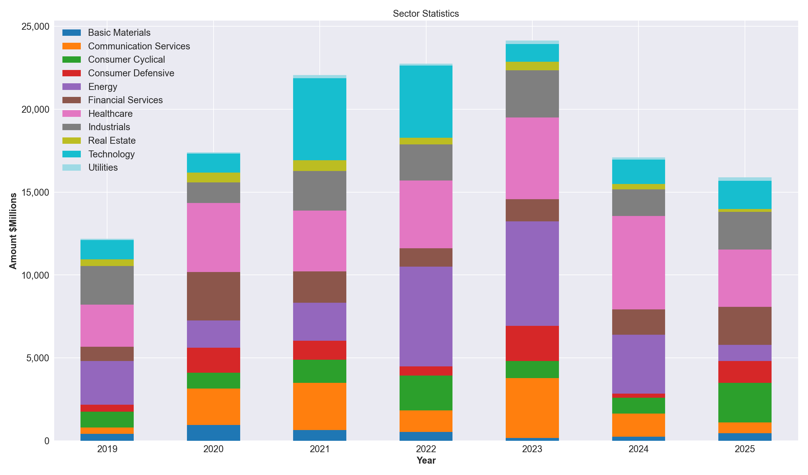

# Insider Trading Analysis

Build a **local, queryable dataset of SEC insider trading filings** (Forms **3**, **4**, and **5**), enrich it with market metadata, and analyze/visualize insider behavior.

This project is **not** about prediction or trade automation. It’s **data engineering + exploratory analysis** of legally disclosed insider transactions.

---

## What This Project Does

At a high level, the project:

1. Fetches insider trading filings from the SEC via an external API
2. Normalizes and cleans raw filing data
3. Enriches transactions with issuer metadata (exchange, sector, industry)
4. Stores data in a PostgreSQL database
5. Aggregates and visualizes insider activity (buy/sell value, reporters, sectors, time)

---

## Docs

Setup, design, environment variables, DB access, and more:

➡️ **[`docs/README.md`](docs/README.md)**

---


## Examples

### Top insider activity by reporter

```bash
insider_cli plot n_most_companies_bs_by_reporter   --start "2022-01-01"   --end "2022-12-31"   --show
```



---

### Deep dive TSLA trades

```bash
insider_cli plot acquired_disposed_line_chart_ticker   --ticker TSLA   --start "2022-01-01"   --end "2022-12-31"   --show
```


---

### Zoom in Elon Musk trades

```bash
insider_cli plot acquired_disposed_line_chart_ticker   --ticker TSLA   --reporter "Elon Musk"   --start "2022-01-01"   --end "2022-12-31"   --show
```


---

### Other insiders trading TSLA

```bash
insider_cli plot n_most_companies_bs_by_reporter   --ticker TSLA   --start "2022-01-01"   --end "2022-12-31"   --show
```


### Sector Stats

```bash
insider_cli plot sector_statistics --start "2019-01-01" --end "2025-10-30" --show
```


---

### SQL: ask a question (LLM-assisted)

Generate, validate, optimize, and execute read-only SQL queries over the insider trading dataset using natural-language prompts.

```bash
insider_cli sql ask --question "Top 20 tickers by total_value in last 90 days"

{
  "question": "Top 20 tickers by total_value in last 90 days",

  "rows": [
    { "issuer_ticker": "LLY",  "total_value_last_90d": "1496317190.8685799961035" },
    { "issuer_ticker": "CRWV", "total_value_last_90d": "1355848031.2484999775912" },
    { "issuer_ticker": "EL",   "total_value_last_90d": "1016405630.06000000002" },
    { "issuer_ticker": "CCC",  "total_value_last_90d": "869569263.19380003" },
    { "issuer_ticker": "BTSG", "total_value_last_90d": "859760003.2600000002" }
    // … 15 more rows
  ],

  "sql": "SELECT issuer_ticker, SUM(total_value) AS total_value_last_90d
          FROM insider_rollup
          WHERE issuer_ticker IS NOT NULL
            AND transaction_date >= NOW() - INTERVAL '90 days'
          GROUP BY issuer_ticker
          ORDER BY total_value_last_90d DESC NULLS LAST
          LIMIT 20;",

  "final_sql": "SELECT issuer_ticker, SUM(total_value) AS total_value_last_90d
                FROM insider_transactions
                WHERE issuer_ticker IS NOT NULL
                  AND transaction_date >= NOW() - INTERVAL '90 days'
                GROUP BY issuer_ticker
                ORDER BY total_value_last_90d DESC NULLS LAST
                LIMIT 20;",

  "optimized": {
    "notes": [
      "Query already uses an efficient index scan and top-N sort.",
      "Switching from the view to the base table avoids view overhead without changing semantics.",
      "Further performance gains require index-only scans rather than SQL rewrites."
    ],
    "index_suggestions": [
      "CREATE INDEX CONCURRENTLY IF NOT EXISTS ix_insider_transactions_txn_date_cover
       ON public.insider_transactions (transaction_date)
       INCLUDE (issuer_ticker, total_value)
       WHERE issuer_ticker IS NOT NULL;",
      "Optional: BRIN index on transaction_date for very large tables."
    ]
  },
}
```
---